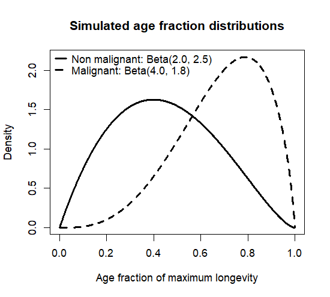

# Simulation of Age and Sex for ACE Cross-species Cancer Data 

This repository contains R code for the first step of a pilot Bayesian hierarchical Gompertz modeling workflow for the ACE cross-species cancer data.

The goal of this step is to convert the original ACE species level dataset into a simulated individual level dataset. The original dataset contains one row per species, with the number of necropsies, cancer counts, taxonomic information, and life history traits. However, a Gompertzian hazard model requires individual level records with age, sex, and event status. Because true age and sex resolved records are not currently available, we simulate these values for model development and assurance analysis.

## Main idea

For this pilot simulation, we use the total number of necropsies for each species as the total number of simulated animals for that species. For example, if a species has 45 necropsies, the simulated dataset includes 45 animals for that species. We also preserve the original malignancy count. If that species has 12 malignant cases, then exactly 12 of the 45 simulated animals are assigned malignancy status 1, and the remaining 33 are assigned malignancy status 0. This produces an individual level dataset that keeps the original ACE malignancy and necropsy structure while adding simulated age and sex values needed for the next modeling step. 

## Life history cleaning and imputation

The script uses three life history traits:

```text
adult_weight_G
Gestation_M
max_longevity_M
```

Because life history data were not available for some species in the original databases used to extract these traits, missing values were represented as `0`, `NA`, or `-1`. Since maximum longevity is required to simulate individual ages, and body mass and gestation length will be used in later modeling steps, these unavailable values were treated as missing and filled using taxonomic information.
Missing life history values are filled using taxonomic medians from the most specific available level to the broadest level:

```text
Genus
Family
Orders
Clade
Class
Global median
```

For example, if maximum longevity is missing for one species, the script first tries to fill it using the median longevity of species in the same genus. If that is not available, it tries family, then order, then clade, then class, and finally the global median. The filled maximum longevity value is then used to simulate age.

## Sex simulation

Sex is simulated independently for each animal using a uniform distribution and a 50 to 50 probability:

```r
sex <- ifelse(runif(n_animals) <= 0.5, "F", "M")
```

This is only a placeholder assumption and can be replaced later if real sex information becomes available.

## Age simulation

Age is simulated as a fraction of the filled maximum longevity for each species:

```text
simulated age = age fraction × filled maximum longevity
```

The age fraction is drawn from beta distributions bounded between 0 and 1.

Non-malignant animals are simulated with a broader age distribution:

```r
rbeta(n_animals, shape1 = 2.0, shape2 = 2.5)
```

Malignant animals are simulated with an older shifted distribution:

```r
rbeta(n_animals, shape1 = 4.0, shape2 = 1.8)
```

This makes malignant animals older on average, which is consistent with the general expectation that malignancy risk increases with age.



The output age variables are:

```r
age_months <- age_fraction * max_longevity_M
age_years  <- age_months / 12
```

For malignant animals, simulated age represents age at malignancy diagnosis. For non-malignant animals, simulated age represents age at censoring, meaning the animal was observed up to that age but malignancy was not recorded.

## Output

The script creates one Excel file:

```text
ACE_individual_level_simulated_age_sex.xlsx
```

This dataset will be used in the step 2 to fit a pilot Bayesian hierarchical Gompertz model for malignancy.

